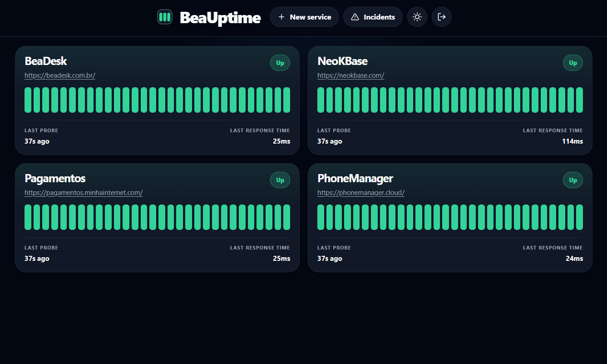

# BeaUptime — Free Uptime Monitoring on Cloudflare's Free Plan

**Full uptime monitoring at zero cost.** BeaUptime runs entirely inside Cloudflare's free-tier infrastructure — no servers to manage, no monthly bills, no vendor lock-in beyond what you already have for free.

Open-source and self-hosted, BeaUptime combines a public status page, a private admin dashboard, scheduled checks, incident tracking, and optional email alerts — all deployed as a single Cloudflare Worker.

<p align="center">
  
</p>

---

## 🆓 Zero Cost. No Servers. No Bills.

BeaUptime is designed from the ground up to fit entirely within [Cloudflare's free plan](https://www.cloudflare.com/plans/):

| Cloudflare Product | Free Plan Limit | How BeaUptime Uses It |
| --- | --- | --- |
| **Workers** | 100,000 req/day | API + static asset serving |
| **Workers Cron Triggers** | 5 cron jobs | Scheduled monitoring every minute |
| **D1 (SQLite)** | 5 GB storage, 5M reads/day | All check history and incident data |
| **Email Routing** | Included on free zones | Optional downtime alert emails |

> No credit card required. No surprise charges. No infrastructure to manage.
> Just a Cloudflare account and a few `wrangler` commands.

---

## Why BeaUptime

Most uptime monitoring tools either cost money or require you to run your own server. BeaUptime eliminates both problems by running entirely on Cloudflare's edge — globally distributed, highly available, and **free for small deployments**.

- ✅ **$0/month** — fits entirely within Cloudflare's free plan
- ✅ **No server** — runs as a Cloudflare Worker, not a VPS or container
- ✅ **No database to manage** — uses Cloudflare D1 (managed SQLite)
- ✅ **Globally distributed** — Cloudflare's edge network handles availability
- ✅ **One deployment** — app, API, and cron jobs in a single Worker
- ✅ **Public status page** without exposing the admin console
- ✅ Monitor both **HTTP endpoints** and **TCP ports**
- ✅ Automatic incident lifecycle — open on failure, resolve on recovery
- ✅ Optional **email alerts** via Cloudflare Email Routing (also free)

---

## Features

- Public status page at `/status`
- Password-only admin access for a single operator
- Private dashboard for services, incidents, and monitoring summary
- HTTP checks with expected status validation
- TCP connectivity checks using Cloudflare sockets
- Automatic incident open/resolve lifecycle
- Optional email alerts through Cloudflare `send_email`
- Manual actions from the dashboard: run checks now and test a single service
- Uptime views for 1, 7, 30, 365, and 730-day windows
- Static public pages served from Worker assets

---

## Stack

Everything runs on Cloudflare's free tier:

- **Cloudflare Workers** — serverless compute (free plan)
- **Cloudflare D1** — managed SQLite database (free plan)
- **Cloudflare Cron Triggers** — scheduled monitoring (free plan)
- **Cloudflare Email Routing** — alert emails (free, optional)
- Hono · Vue 3 · Vite + Vite SSG · TypeScript · Bun

---

## How It Works

The project is a small monorepo:

- `worker-api/`: Hono API, cron jobs, monitoring logic, auth, and D1 access
- `web-vue/`: public pages and the protected dashboard UI
- `worker-shared/contracts/`: shared request/response and domain types

At runtime, one Cloudflare Worker does three jobs:

1. Serves the frontend assets
2. Exposes the API under `/auth` and `/api/v1/*`
3. Runs scheduled monitoring and cleanup jobs

Current scheduled jobs:

- Every minute: probes enabled services
- Daily at `03:17`: deletes old resolved incidents

---

## Requirements

- [Bun](https://bun.sh/)
- A Cloudflare account (free plan is enough)
- A Cloudflare D1 database (created via `wrangler`, free)

---

## Deploy To Cloudflare

### 1. Install dependencies

```bash
bun install
```

### 2. Authenticate with Cloudflare

Log in with Wrangler before creating remote resources or deploying:

```bash
bunx wrangler login
```

Optional: verify that Wrangler is authenticated against the correct account:

```bash
bunx wrangler whoami
```

### 3. Create the D1 database

Create a database in your Cloudflare account:

```bash
bunx wrangler d1 create bea-uptime
```

According to Wrangler's help and Cloudflare's D1 docs, this command should provide the database UUID.

Copy that database UUID into `wrangler.jsonc` as `d1_databases[0].database_id`.

If your terminal output does not clearly show it, fetch the database details explicitly:

```bash
bunx wrangler d1 list
```

### 4. Configure variables and bindings

Update `wrangler.jsonc` before deploying:

- replace `d1_databases[0].database_id` with your own D1 database id
- replace the example value in `AUTH_ROOT_SECRET`
- replace or remove the example values in `ALERT_TO_EMAIL` and `ALERT_FROM_EMAIL`
- keep `SEND_EMAIL` only if you want email alerts configured in Cloudflare

Main runtime variables:

| Name | Required | Purpose |
| --- | --- | --- |
| `AUTH_ROOT_SECRET` | Yes | Admin password |
| `SERVICE_LIMIT` | No | Max number of configured services |
| `DEFAULT_TIMEOUT_MS` | No | Default probe timeout |
| `INCIDENT_RETENTION_DAYS` | No | How long resolved incidents are kept |
| `CORS_ALLOWED_ORIGINS` | No | Comma-separated browser origins allowed to call the Worker outside its own origin |
| `ALERT_TO_EMAIL` | No | Alert recipient |
| `ALERT_FROM_EMAIL` | No | Alert sender |
| `SEND_EMAIL` | No | Cloudflare email binding used to send alerts |

Current defaults from the codebase:

- service limit: `10`
- default timeout: `8000ms`
- incident retention: `730` days

### 5. Apply remote migrations

```bash
bun run d1:migrate:remote
```

### 6. Deploy

```bash
bun run deploy
```

The deploy script builds the frontend and Worker, then runs `wrangler deploy`.

---

## Run Locally

### 1. Create `.dev.vars`

Copy `.dev.vars.example` to `.dev.vars` and adjust the values:

```dotenv
AUTH_ROOT_SECRET=change-this-password
# Optional
# CORS_ALLOWED_ORIGINS=http://localhost:5173
# ALERT_TO_EMAIL=you@example.com
# ALERT_FROM_EMAIL=alerts@example.com
```

Notes:

- `AUTH_ROOT_SECRET` is the admin password used by the login screen
- do not commit real secrets
- local development still uses the Worker config in `wrangler.jsonc`
- set `CORS_ALLOWED_ORIGINS=http://localhost:5173` when you want to allow browser requests from the Vite dev server or another frontend origin

### 2. Apply local migrations

```bash
bun run d1:migrate:local
```

### 3. Optional: seed local data

```bash
bunx wrangler d1 execute DB --local --file ./worker-api/seed/dev-seed.sql --config ./wrangler.jsonc
```

### 4. Start the local app

Build the frontend once, then start the Worker:

```bash
bun run build:web
bun run dev:api
```

This is the most reliable local full-stack flow because the Worker serves the built frontend assets and the API from the same origin.

There is also a standalone frontend dev server:

```bash
bun run dev:web
```

To call the Worker API from the Vite dev server or a separate frontend deployment, configure both sides:

1. In `.dev.vars`, allow the frontend origin:

```dotenv
CORS_ALLOWED_ORIGINS=http://localhost:5173
```

2. In `web-vue/.env.local`, point the frontend to the Worker origin:

```dotenv
VITE_API_BASE_URL=http://localhost:8787
```

With no `VITE_API_BASE_URL`, the frontend uses same-origin requests, which is the default production setup.

### 5. Configure email alerts (optional)

BeaUptime only sends email notifications when all of the following are configured:

- the `SEND_EMAIL` binding
- `ALERT_TO_EMAIL`
- `ALERT_FROM_EMAIL`

Cloudflare requirements:

1. Enable Email Routing on the same Cloudflare zone used by the Worker.
2. Add and verify the recipient address in Email Routing destination addresses.
3. Use a sender address from that same domain for `ALERT_FROM_EMAIL`.

This repository already includes a `SEND_EMAIL` binding in `wrangler.jsonc`. Then set the alert addresses in your environment:

```dotenv
ALERT_TO_EMAIL=you@example.com
ALERT_FROM_EMAIL=alerts@your-domain.com
```

Notes:

- `ALERT_TO_EMAIL` must be a verified Email Routing destination address
- `ALERT_FROM_EMAIL` must belong to the domain where Email Routing is enabled
- if you want to restrict delivery, configure the binding with `destination_address` or `allowed_destination_addresses`

---

## Build

```bash
bun run build
```

This generates:

- `dist/web-vue/` for the frontend assets
- `dist/worker-api/` for the Worker build output

---

## Monitoring Model

- Supported service types: `GET` and `TCP`
- HTTP checks require an expected status code
- TCP checks validate that the target host and port can be reached
- A service becomes an incident after 2 consecutive failures
- Incidents are resolved automatically on the next successful check
- Public status only shows enabled services

---

## Routes

- `/`: public landing page
- `/status`: public status page
- `/dashboard`: protected admin console
- `/health`: health endpoint
- `/auth/*`: login/session endpoints
- `/api/v1/*`: monitor, services, status, and incidents APIs

---

## Project Structure

```text
.
|-- web-vue/
|-- worker-api/
|-- worker-shared/contracts/
|-- scripts/
|-- wrangler.jsonc
```

---

## Contributing

Issues and pull requests are welcome.

See `CONTRIBUTING.md` for the development workflow and submission guidelines.
